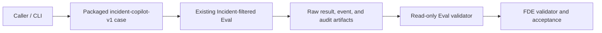

# Simulated customer scenario

## Current offline evidence architecture

The implemented path is deliberately short. Every box below exists in the public package or in the
generated [canonical pilot](pilot-evidence/); no external connector is implied.

The caller supplies a 40-character source identity and a fresh output directory. The packaged case
fixes the ten cell/resource identities. Existing Eval produces the nested evidence; the Eval
validator rechecks it without execution; the FDE validator derives the outer
[acceptance](pilot-evidence/acceptance.json) and verifies the exact
[manifest inventory](pilot-evidence/case-manifest.json). This layering reuses the published
Incident/Eval contracts rather than creating another executor.

| External system | Current status | What would be required before it enters the path |
|---|---|---|
| Ticketing | not connected | Discovery-approved fields, identity mapping, read/write scope, redaction, failure semantics |
| Monitoring / telemetry | not connected | Source authority, freshness contract, tenant boundary, missing/stale signal handling |
| Human approval | not connected | Authenticated approver identity, policy ownership, expiry/revocation, audit retention |
| Deployment | not connected | Explicit change boundary, canary/rollback owner, blast-radius control, independent verification |
| Service control | not connected | Target inventory, least privilege, idempotency key scope, emergency disable and operator override |

The SHA-256 chain and exact path allowlist detect inconsistent or extra artifacts inside this
offline bundle. They are not signatures, host isolation, network controls, or evidence that the
future systems above are safe to connect.
